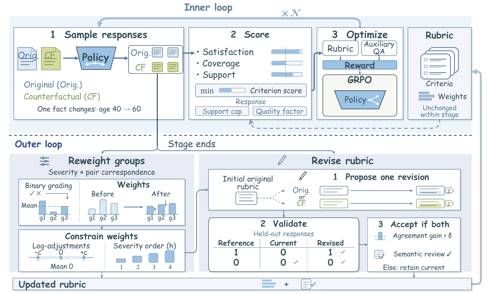

<div align="center">

# MetaRubric

### Learning to Reward for Rubric-Based Reinforcement Learning

**[Yuxuan Fan](https://github.com/yuxuanfanOrion) · [Jaehong Yoon](https://jaehong31.github.io/)<sup>†</sup>**

Nanyang Technological University, Singapore<br>
<sup>†</sup> Corresponding author

[](https://arxiv.org/abs/2610.02824)
[](https://metarubric.github.io)
[](#citation)

**[Highlights](#highlights) · [Method](#method) · [Quick Start](#quick-start) · [Training](#training) · [Code Map](#code-map)**

</div>

---

A rubric judge can award credit even when a response omits the information a criterion requires. We call this **Vacuous Credit**. MetaRubric alternates **evidence-aware policy optimization** with **response-guided rubric adaptation**, using counterfactual prompt pairs to connect rubric credit to the content of each response.

This release includes the MetaRubric implementation, integrated [verl](https://github.com/verl-project/verl) source, and a **HealthBench configuration for Qwen3-4B-Instruct-2507**, with thinking disabled. The [paper](https://arxiv.org/abs/2610.02824) and [project page](https://metarubric.github.io/#results) present the full experiments and results.

<a id="highlights"></a>
## ✨ Highlights

- **Evidence-aware rewards.** Criterion scores account for satisfaction, coverage, and support, alongside an auxiliary QA reward from an independent reader.
- **Counterfactual pairs.** Original prompts and counterparts with one changed fact stay together in the GRPO training batch.
- **Adaptive rubrics.** Stage-boundary updates adjust bounded criterion-group weights and review proposed criterion revisions against a fixed reference panel.
- **Traceable training stages.** Immutable rubric snapshots, snapshot-bound reward records, and checkpoint resumption connect each stage to its reward definition.

<a id="method"></a>
## 🧩 Method

<p align="center">
  <a href="https://metarubric.github.io/assets/metarubrics_overview.pdf">
    
  </a>
</p>

**Inner loop:** hold the rubric fixed, sample responses to original and counterfactual prompts, and optimize the policy with rubric and auxiliary QA rewards.

**Outer loop:** use the stage's responses to update criterion-group weights and propose a rubric revision. Accept a revision only after semantic review and improved agreement on held-out responses; publish the next immutable snapshot for the following stage.

[Method details →](https://metarubric.github.io/#method)

<a id="quick-start"></a>
## 🚀 Quick Start

### 1. Install

Use Python 3.10+ and a CUDA-capable Linux environment for training. The supplied launch configuration uses three GPUs: GPU 0 for the exam reader, GPUs 1 and 2 for the policy.

```bash
git clone https://github.com/metarubric/metarubric.git
cd metarubric

python -m venv .venv
source .venv/bin/activate
pip install -e ./vendor/verl
pip install -e .
pip install -r requirements-runtime.txt
```

| Runtime component | Version |
| :--- | :--- |
| PyTorch / CUDA | 2.8.0 / 12.8 |
| vLLM | 0.11.0 |
| Transformers | 4.57.6 |
| FlashAttention | 2.8.3 |
| Included verl | 0.8.0.dev · `7aed6b2` |

The full verl revision is `7aed6b230776f963fa09509c10d9c3a767d1102c`. The integration recorded in [`framework/verl.patch`](framework/verl.patch) is **already applied** to the bundled source.

### 2. Configure

```bash
cp .env.example .env
# Edit .env, then export its values in each shell used below.
set -a
source .env
set +a
```

Replace every `/path/to/...` value in [`.env.example`](.env.example).

| Setting | Purpose |
| :--- | :--- |
| `ACRE_MODEL_PATH` | Local Qwen3-4B-Instruct-2507 policy |
| `ACRE_READER_MODEL_PATH` | Local Qwen3-1.7B exam reader |
| `ACRE_TRAIN_FILE` | Prepared `healthbench/train.parquet` |
| `ACRE_VALIDATION_FILE` | Independently prepared validation Parquet |
| `METARUBRIC_WORK_DIR` | Workspace containing the `healthbench/` directory |
| `ACRE_OUTPUT_DIR` | Training checkpoints and reward records |
| `OPENAI_API_KEY` | Authentication for the remote judge and outer loop |

The judge and outer loop use the official OpenAI Python SDK's Chat Completions interface at `https://api.openai.com/v1`; the endpoint is fixed in code. The exam reader runs as a local OpenAI-compatible service.

### 3. Prepare data

Start from a Parquet file containing the original/counterfactual contracts and exam items:

```bash
python scripts/prepare_healthbench.py \
  /path/to/source.parquet \
  /path/to/workspace/healthbench
```

This writes `train.parquet`, `snapshot-0.json`, and `dataset_audit.json`. Set `ACRE_TRAIN_FILE` to the generated training file and supply an independent validation file through `ACRE_VALIDATION_FILE`.

<details>
<summary><strong>Input format and pairing</strong></summary>

Each row uses verl's prompt-data format:

| Field | Contents |
| :--- | :--- |
| `prompt` | Chat messages |
| `data_source` | `acre_healthbench_twin` or `acre_healthbench_indomain` |
| `reward_model.ground_truth` | JSON-encoded contract |
| `extra_info.split` | `train` for training rows |

The contract contains `sample_id`, `pair_id`, `side`, `prompt`, `rubrics`, `rubric_meta`, and the exam items consumed by the reward implementation. Paired rows share a `pair_id` and have `orig`/`twin` sides. Shuffle at the pair level before preparation; the launcher sets `data.shuffle=False` to preserve adjacent pairs within GRPO batches. The preparation script also retains unpaired original cases.

The release contains code and configuration; datasets, model weights, credentials, results, and runtime logs must be supplied separately.

</details>

<a id="training"></a>
## 🎓 Training

### Start the services

In **two separate shells**, activate `.venv` and export `.env` as above, then start one service per shell:

```bash
# Shell 1: HealthBench evaluator
bash scripts/start_judge.sh
```

```bash
# Shell 2: Qwen3-1.7B exam reader (GPU 0 by default)
bash scripts/start_exam_reader.sh
```

### Run a policy stage

In a third shell with the same environment, train to step 10 using the initial rubric snapshot:

```bash
bash scripts/run_segment.sh 10 /path/to/workspace/healthbench/snapshot-0.json
```

`TARGET_STEP` is the total training-step target. When a latest-checkpoint tracker exists, the wrapper resumes from that checkpoint. The launcher uses the included `vendor/verl`, preserves adjacent-pair semantics and dynamic token budgets, and writes snapshot-bound reward records.

### Update the rubric and continue

After the stage finishes at a complete checkpoint boundary:

```bash
PYTHONPATH=src python scripts/outer_boundary.py \
  healthbench 10 /path/to/workspace/healthbench/snapshot-0.json

bash scripts/run_segment.sh 20 /path/to/workspace/healthbench/snapshot-after-10.json
```

The outer step updates bounded weights and may accept one model-reviewed counterfactual criterion revision using a fixed reference panel. The next stage reads the new immutable snapshot.

<a id="code-map"></a>
## 📦 Code Map

| Location | Contents |
| :--- | :--- |
| [`src/metarubrics/`](src/metarubrics/) | Rubric revisions, weight updates, immutable snapshots, and training reward hook |
| [`evaluator/`](evaluator/) | Judge HTTP service, rubric prompts, parsing, and scalar reward computation |
| [`scripts/`](scripts/) | Data preparation, service launchers, training stages, and outer-loop updates |
| [`vendor/verl/`](vendor/verl/) | Complete integrated verl source, workers, configs, tests, and upstream documentation |
| [`framework/verl.patch`](framework/verl.patch) | Record of the applied verl integration |
| [`tests/`](tests/) | CPU checks with synthetic fixtures and mocked services |
| [`.env.example`](.env.example) | HealthBench experiment configuration |

Bundled verl examples are upstream examples. Use `.env.example` and `scripts/` for the MetaRubric experiment.

### CPU checks

```bash
PYTHONPATH=src:evaluator:scripts python -m unittest discover -s tests -v
python -m compileall -q src evaluator scripts
```

These checks use no model-service or GPU calls.

<a id="citation"></a>
## 📄 Citation

If you use MetaRubric in your research, please cite our [paper](https://arxiv.org/abs/2610.02824). You can also download [`citation.bib`](citation.bib).

```bibtex
@misc{fan2026metarubric,
  title = {MetaRubric: Learning to Reward for Rubric-Based Reinforcement Learning},
  author = {Fan, Yuxuan and Yoon, Jaehong},
  year = {2026},
  eprint = {2610.02824},
  archivePrefix = {arXiv},
  primaryClass = {cs.AI},
  url = {https://arxiv.org/abs/2610.02824}
}
```

## Acknowledgements

MetaRubric builds on [verl](https://github.com/verl-project/verl), [Qwen3](https://github.com/QwenLM/Qwen3), [vLLM](https://github.com/vllm-project/vllm), and [HealthBench](https://github.com/openai/healthbench). The bundled verl source retains its [upstream license](vendor/verl/LICENSE) and attribution.
